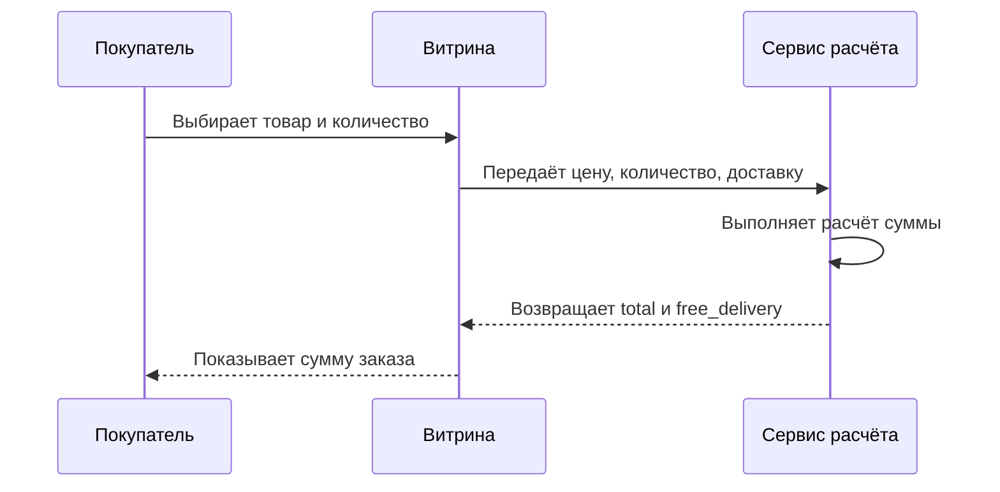

## Описание процесса

Процесс начинается в момент, когда витрина получает параметры будущего заказа. Далее данные передаются в локальную функцию расчёта, а результат выводится пользователю.

## Mermaid sequence

## Контрольные точки

| Шаг                | Контроль                            |
|--------------------|-------------------------------------|
| Приём данных       | Проверено наличие цены и количества |
| Выполнение расчёта | Формула применена корректно         |
| Возврат результата | Сумма округлена до двух знаков      |